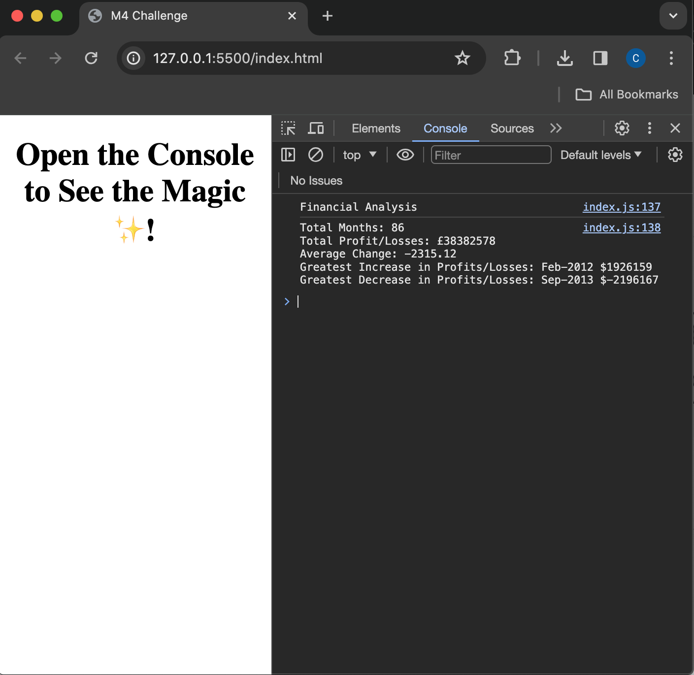

# Catherine Beagent Unit 4 Challenge - Console Finances

## Description

This project was created to analyse the financial records of a company in a web-browser console, using JavaScript. Across the recorded period, the analysis includes a breakdown of the number of months , the net total amount of profit/loss, the average of the profit/loss changes month to month, and the months and values of the greatest increases and decreases in profit and loss.

## Installation
n/a

## Usage

The website can be publically accessed at https://cgbea.github.io/Console-Finances/. 

## Credits
The starter code and records were provided by edX as part of its Skills for Life front-end skills course. JavaScript information found at [W3Schools](https://www.w3schools.com/), [StackOverflow](https://stackoverflow.com/) and [mdn web docs](https://developer.mozilla.org/en-US/docs/Learn) contributed to the creation of this repo.

## License
MIT License

Copyright (c) 2023 cgbea

Permission is hereby granted, free of charge, to any person obtaining a copy
of this software and associated documentation files (the "Software"), to deal
in the Software without restriction, including without limitation the rights
to use, copy, modify, merge, publish, distribute, sublicense, and/or sell
copies of the Software, and to permit persons to whom the Software is
furnished to do so, subject to the following conditions:

The above copyright notice and this permission notice shall be included in all
copies or substantial portions of the Software.

THE SOFTWARE IS PROVIDED "AS IS", WITHOUT WARRANTY OF ANY KIND, EXPRESS OR
IMPLIED, INCLUDING BUT NOT LIMITED TO THE WARRANTIES OF MERCHANTABILITY,
FITNESS FOR A PARTICULAR PURPOSE AND NONINFRINGEMENT. IN NO EVENT SHALL THE
AUTHORS OR COPYRIGHT HOLDERS BE LIABLE FOR ANY CLAIM, DAMAGES OR OTHER
LIABILITY, WHETHER IN AN ACTION OF CONTRACT, TORT OR OTHERWISE, ARISING FROM,
OUT OF OR IN CONNECTION WITH THE SOFTWARE OR THE USE OR OTHER DEALINGS IN THE
SOFTWARE.
